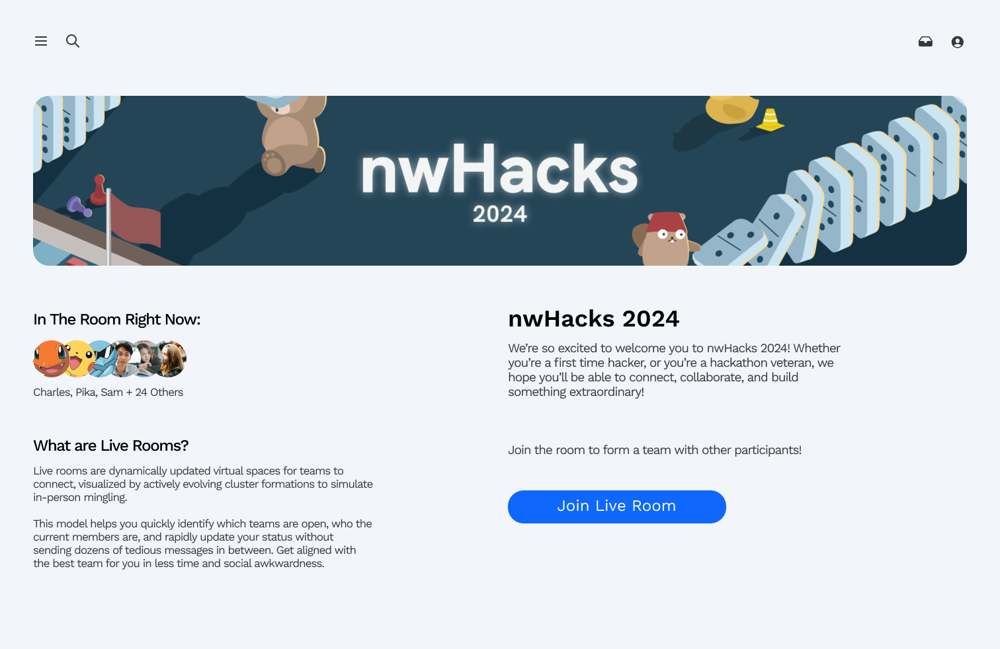
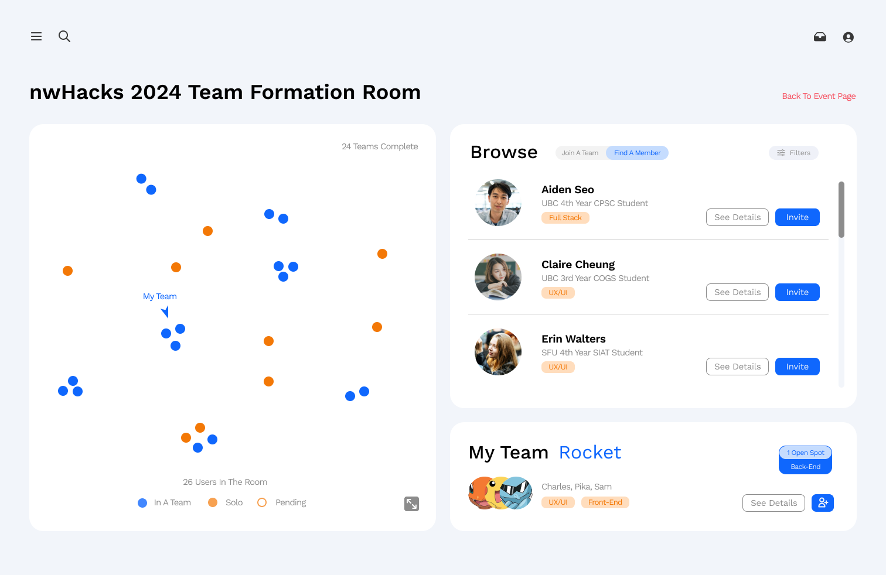

<h1>HackBuddies</h1>

<h3>Intuition</h3>
Just over 24 hours ago, a few of us were still scrambling to find team members for the hackathon and struggled to coordinate teams with the current team formation process through Discord. We found these pain points: 
- Suboptimal browsing: linear feed is hard to keep track of and use to find teams that align with us/vice versa 
- Rapid changes: people’s team statuses are changing all the time and fail to update their original post, leading to dead-ends in the DMs 
- Tedious messaging admin:** reaching out to individuals is time consuming and doesn’t guarantee availability. new groups recruiting last-minute members have difficulty coordinating communications in time  

